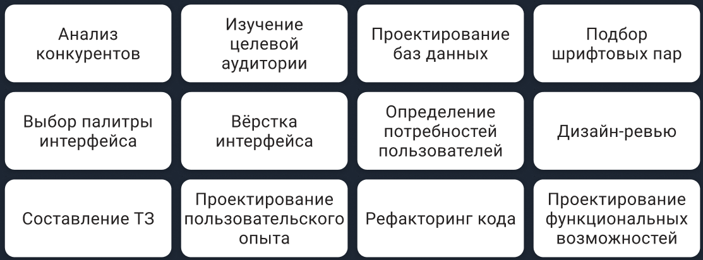

# UX/UI-дизайн и UX/UI-дизайнер

В этом проекте Вы узнаете, что такое UX-, UI-дизайн, чем занимается UX/UI-дизайнер и его основные этапы работы

## Contents

1. [Chapter I](#chapter-i) \
    1.1. [UX/UI-дизайн](#ux/ui-дизайн) \
    1.2 [UX-дизайн](#ux-дизайн) \
    1.3 [UI-дизайн](#ui-дизайн)
2. [Chapter II](#chapter-ii) \
    2.1. [UX/UI-дизайнер](#ux/ui-дизайнер)
3. [Chapter III](#chapter-iii) \
    3.1. [Пайплайн работы](#пайплайн-работы) \
    3.2. [Task 1](#task-1) \
    3.3. [Task 2](#task-2) 

## Chapter I

### UX/UI-дизайн

В нашей жизни мы постоянно встречаемся с различными интерфейсами. Сайты, веб и десктопные приложения, приложения для телефонов, смарт-часов, смарт-телевизоров, интерактивных навигационных панелей в торговых центрах имеют интерфейс, с которым мы взаимодействуем.

UX/UI-дизайн, это направление дизайна, которое занимается созданием и улучшением интерфейсов.

#### UX-дизайн

UX-дизайн, это обширная часть дизайна интерфейсов.

UX расшифровывается как User eXperience или пользовательский опыт. UX описывает пользовательский опыт как целое, принимая во внимание не только пользовательские взаимодействия с определенным сайтом или приложением, но также, их чувства по отношению к продукту или бренду, и то, удовлетворяет ли он их потребностям.

В UX-дизайне акцент идёт на удобство использования, которое достигается за счёт изучения пользователя и его поведенческих особенностей и использования полученных данных для проектирования интерфейса.

#### UI-дизайн

UI расшифровывается как User Interface или пользовательский интерфейс. UI отвечает за внешний вид интерфейса. Как будут выглядеть элементы, какой будет цвет и шрифт в интерфейсе, всё это определяет UI-дизайн.

## Chapter II

### UX/UI-дизайнер

Ввиду различий UX и UI дизайна, можно встретить UX-дизайнеров и UI-дизайнеров, однако чаще UX/UI-дизайн предполагает специалиста сразу в двух областях.

UX/UI-дизайнер занимается разработкой интерфейса от момента формирования идеи до момента подготовки макетов для разработчиков.

## Chapter III

### Пайплайн работы

Всё больше интерфейсов проектируются по принципу Human-centred deign'а.

Human-center design, это человеко-ориентированное проектирование пригодных в использовании и полезных интерактивных систем с учётом особенностей пользователей и их потребностей на основе эргономических принципов.

Пайплайн работы UX/UI-дизайнера выглядит следующим образом:
* сбор информации;
* исследование;
* проектирование интерфейса;
* создание и тестирование прототипа;
* визуальная проработка интерфейса.

Иногда, после тестирования прототипа возникает потребность снова вернуться к пунктам до него, вплоть до сбора информации.

### Task 1

* создайте файл pipeline;
* опишите в файле pipeline какие цели у каждого этапа пайплайна работы UX/UI-дизайнера;
* опишите в файле pipeline какие результаты получаются после каждого этапа пайплайна работы UX/UI-дизайнера;
* поместите файл pipeline в репозиторий.

### Task 2

* ниже представлен набор различных задач, встречающихся при создании продукта:

* создайте файл uxui-tasks;
* выпишите в файл uxui-tasks те задачи, которыми занимается UX/UI-дизайнер;
* укажите рядом с каждой задачей, к какому типу дизайна она относится, UX- или UI- дзиайну;
* поместите файл uxui-tasks в репозиторий.

