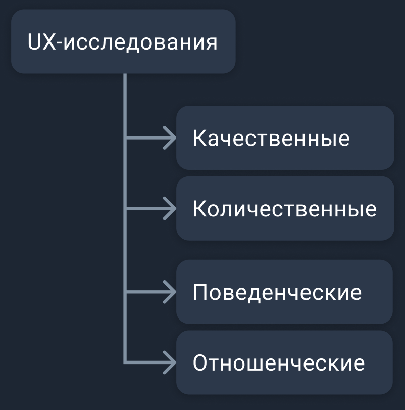

# Методы UX-исследований
В этом проекте вы познакомитесь с первыми шагами создания продукта, а именно, UX-исследованиями.

## Contents

1. [Chapter I](#chapter-i) \
    1.1. [Виды UX-исследований](#виды-ux-исследований) \
    1.2. [Task 1](#task-1)
2. [Chapter II](#chapter-ii) \
    2.1. [Исследования перед проектированием](#исследования-перед-проектированием) \
    2.2. [Task 2](#task-2)
3. [Chapter III](#chapter-iii) \
    3.1. [Описание пользователя](#описание-пользователя) \
    3.2. [Task 3](#task-3)

<h2 id="chapter-i">Chapter I</h2> 
<h3 id="виды-ux-исследований">Виды UX-исследований</h3>

Перед началом проектирования интерфейса, во время неё и после завершения, проводятся UX-исследования. Одни исследования направлены на улучшение уже существующего интерфейса, в котором присутствуют проблемы юзабилити, другие же проводятся ещё до появления интерфейса, с целью понять запросы пользователей и найти варианты удовлетворения этих запросов.

Выделяют количественные и качественные методы исследований, а также отношенческие и поведенческие.

<h3 id="task-1">Task 1</h3>

* создайте design-файл в Figma и назовите его ux-research (файл будет использоваться всеми участниками поэтому не забудьте пригласить всех участников в файл и выдать им права на редактирование);
* опишите в файле "ux-research" каждый вид исследований;
* приведите в файле "ux-research" 2-3 примера каждого вида исследований. 

<h2 id="chapter-iii">Chapter III</h2> 
<h3 id="исследования-перед-проектированием">Исследования перед проектированием</h3>

Проводить исследование перед началом разработки важно, поскольку оно помогает понять, какие потребности возникают у пользователя и возникают ли они в принципе. На этом этапе подтверждаются или опровергаются гипотезы и предположения, анализируются бизнес-требованиия и ограничения, конкуренты и целевая аудитория.

<h3 id="task-2">Task 2</h3>

* напишите в файле "ux-research" по одному UX-исследований, которые проводятся перед началом проектирования и разработки, от каждого участника команды;
* напишите в файле "ux-research", являются ли указанные Вами методы качественными или количественными и отношенческими или поведенческими или являются смешанным типом;
* опишите в файле "ux-research" задачу и принцип работы каждого метода, указанного вами в этом задании.

<h2 id="chapter-iv">Chapter IV</h2> 
<h3 id="описание-пользователя">Описание пользователя</h3>

Поскольку всё больше и больше приложений и сайтов используют Human-centered Design, важной задачей является понять, кто является аудиторией приложения или сайта, для которого создаётся интерфейс, какие задачи она преследует и в каких технических и социальных условиях она взимодействует с интерфейсом.

<h3 id="task-3">Task 3</h3>

* вам предстоит провести UX-исследование вашей аудитории;
* придумайте тему сервиса или выберите понравившуюся тему из предложенных и напишите тему в файл ux-research:\
сервис покупки правильного питания с формированием корзины по макронутриентам;\
музейный гид;\
сервис поиска людей для передержки и выгула животных;\
сервис обмена саженцами комнатных растений;\
сервис поиска людей для совместной игры на уличных площадках;\
сервис бронирования мест в коворкинге/офисе.
* составьте одну группу целевой аудитории от каждого участника
* проведите в команде анализ конкурентов вашего сервиса и составьте таблицу (если сервис уникален и не имеет аналогов, то проанализируйте смежные по функционалу сервисы. Если и таковых нет, тогда напишите об отсутствии конкурентов);
* составьте в команде по 3 продуктовые гипотезы на каждую из групп целевой аудитории
* распределите между участниками команды методы исследований (каждый участник команды может взять несколько методов; методы могут быть распределены непоровну):\
опрос;\
интервью;\
фокус-группа.
* проведите исследования, чтобы подтвердить или опровергнуть гипотезы:\
если тебе нужно сделать опрос, то создай опрос и опроси не менее 15 человек принадлежащих группам ЦА. Приведи в файле ux-research статистику по вопросам с вариантами ответа и минимум 5 ответов на каждый открытый вопрос, которые, на твой взгляд наиболее явно определяют истинность/ложность гипотез (перед ответами на открытые вопросы напиши сам вопрос);\
если тебе нужно провести интервью, то опроси более чем 3 людей (желательно охватить все группы ЦА). Приведи в файле ux-researh сводку по итогам каждого интервью (обязательно напиши, какой группе ЦА принадлежал респондент);\
если тебе нужно модерировать фокус-группу, то собери очную или онлайн встречу для обсуждения будущего продукта. Приведи в файле ux-researh сводку по итогам обсуждения сервиса фокус-группой.
* при составлении опроса и проведении интервью, старайся уделить больше внимания открытым вопросам;
* собрав данные из исследований, проанализируйте в команде, подтвердились или опроверглись составленные вами гипотезы и напишите результаты рядом с каждой из них (если данных оказалось недостаточно, то укажите об этом рядом с гипотезой);
* на основе полученных из исследований данных, составьте портреты “персон” (по 2 персоны на каждого участника команды) и сценарий взаимодействия "персон" с сервисом (можно воспользоваться шаблоном “персон” в FigJam, но нужно будет его перенести в design-файл ux-research);
* выделите в файле "ux-research" проблемы (как минимум одну для одной персоны), с которыми может столкнуться пользователь при прохождении сценария и напишите возможное решение (возможно несколько решений) для них;
* экспортируйте design-файл "ux-research";
* загрузите файл "ux-research.fig" в репозиторий.

