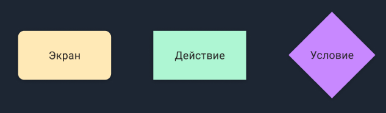
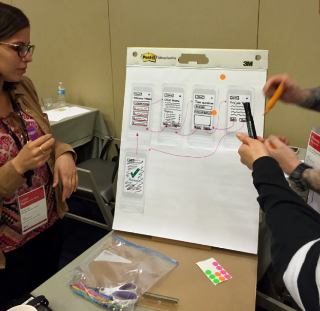
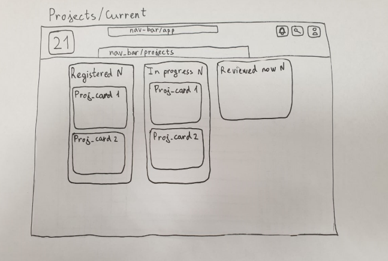
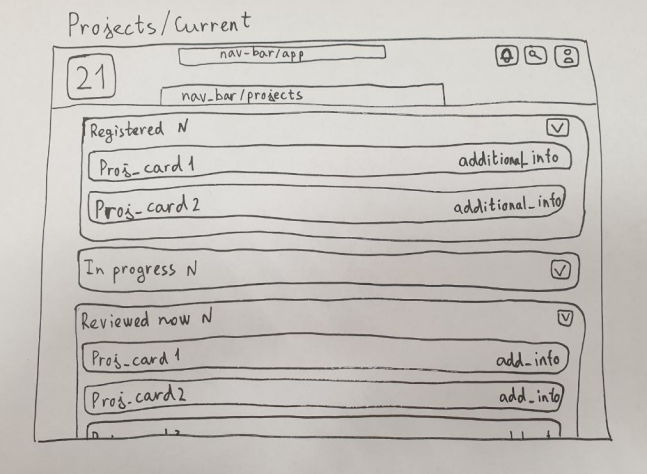

# Name of the project
UX-проектирование

## Contents

1. [Chapter I](#chapter-i) \
    1.1. [UserFlow](#userflow) \
    1.2. [Task 1](#task-1) \
    1.3. [CJM](#cjm) \
    1.4. [Task 2](#task-2)
2. [Chapter II](#chapter-ii) \
    2.1. [Правила и паттерны](#правила-и-паттерны) \
    2.2. [UX-паттерны](#ux-паттерны) \
    2.3. [UX-правила](#ux-правила) \
    2.4. [Task 3](#task-3) 
3. [Chapter III](#chapter-iii) \
    3.1. [Бумажные эскизы](#бумажные-эскизы) \
    3.2. [Task 4](#task-4) \
    3.3. [Wireframes и wireflow](#wireframes-и-wireflow) 
4. [Chapter IV](#chapter-iv) \
    4.1. [Bonus task 1](#bonus-task-1) 

<h2 id="chapter-i">Chapter I</h2> 

В прошлом проекте ты составлял портреты “персон” и описывал сценарии их взаимодействия с сервисом. В этом проекте ты перейдёшь на следующий этап после изучения ЦА и их потребностей.

<h3 id="userflow">UserFlow</h3>

User flow – это визуальное представление пути пользователя, который он проходит для достижения поставленной цели.

Благодаря тем сценариям взаимодействия, которые ты делал(а) в прошлом проекте, UserFlow будет привязан к твоей аудитории и не будет оторван от реальности.

User Flow описывает конкретные последовательные действия пользователей в каждом сценарии. Чаще всего применяют блок-схемы с 3 “базовыми” блоками.

<h3 id="task-1">Task 1</h3>

* создай design-файл в Figma;
* назови его “ux-project”;
* сделай UserFlow сервиса из прошлого проекта (можно использовать FigJam и шаблон “FlowCharts”, а потом перенести схему в design-файл);
* совет: постарайся рассмотреть все возможные экраны, как, например, авторизация и личный кабинет, ведь приложение, это не только основной функционал, но и все дополнительные возможности, которые этот функционал окружают.

<h3 id="cjm">CJM</h3>

CJM расшифровывается как Customer Journey Map.

По своему наполнению, CJM схож с UserFlow, однако, если UserFlow учитывает только действия пользователя, то CJM направлен на то, чтобы определить, какие ощущения испытывает пользователь на каждом из этапов, какие барьеры встречает пользователь (“болевые точки”) на своём пути и в каких местах какие улучшения можно сделать.

Благодаря тому, что в прошлом проекте ты выяснил(а), кто твои потенциальные пользователи, при составлении CJM ты сможешь представить взаимодействие с интерфейсом не “усреднённого” человека.

<h3 id="task-2">Task 2</h3>

* сделай CJM (можно использовать шаблон Customer journey map от FigJam) сервиса для двух персон из прошлого проекта в файле "ux-project" (обязательно оставь описание той “персоны” для которой делаешь CJM);
* рассмотри весь путь от того, как пользователь начал взаимодействие с устройством, в котором взаимодействует с сервисом (web или мобильное приложение), до того, когда он достиг своей цели.

<h2 id="chapter-ii">Chapter II</h2>

<h3 id="правила-и-паттерны">Правила и паттерны</h3>

Представив струкутуру сервиса в текстово-схематичном виде, самое время переходить к проектированию интерфейса будущего приложения, однако, прежде чем приступать к генерации идей, необходимо ознакомиться с тем, как это сделать более корректно.

<h3 id="ux-паттерны">UX-паттерны</h3>

UX-паттерн - это решение “проблемы” (в случае UX/UI-дизайна, проблемой будет то, как спроектировать тот или иной функционал сервиса), которое “зарекомендовало” себя, как удачное и которым пользуется большое количество пользователей.

Существует множество различных UX-паттернов. С развитием технологий разработки, появляются новые решения, которые вытесняют более устаревшие.

<h3 id="ux-правила">UX-правила</h3>

С помощью исследований, были получен набор UX-законов, которые важно применять при проектировании интерфейсов.

Одними из основных являются:
* Закон Хика;
* Закон Якобы;
* Закон Фиттса;
* Закон Миллера;
* Закон Паркинсона.

<h3 id="task-3">Task 3</h3>

* опиши в файле “ux-project” суть законов, описанных выше, приминительно к UX/UI-дизайну;
* найди ещё минимум 2 закона/принципа и опиши их суть в файле “ux-project”.

<h2 id="chapter-iii">Chapter III</h2>

<h3 id="бумажные-эскизы">Бумажные эскизы</h3>

Теперь, узнав о паттернах проектирования, можно переходить к генерации интерфейса твоего сервиса.

Прежде чем начинать проектировать в цифровом виде, можно делать бумажные эскизы, поскольку их создание быстрое и доступное. Любые изменения можно вносить прямо во время обсуждения, после получения обратной связи. Через бумажные прототипы можно увидеть первые недостатки сгенерированных идей.

Вот пример двух вариантов средне-детализированного бумажных эскизов экрана текущих проектов платформы Школы 21. Сделаны они были во время обсуждения необходимых элементов на данном экране и одна из идей была выбрана, как вариант для реализации.

<h3 id="task-4">Task 4</h3>

* сделай бумажные эскизы экранов твоего сервиса (учитывай все экраны, которые ты указывал в UserFlow);
* совет: не “мельчи”, возьми лист А4 и маркер и используйте весь лист на 1 экран (если это мобильное приложение, то 2-3)
* сфотографируй или отсканируй эскизы;
* сделай в файле "ux-project" страницу sketches and wireframes;
* помести фотографии/сканы на страницу sketches and wireframes.

<h3 id="wireframes-и-wireflow">Wireframes и wireflow</h3>

Теперь, когда у нас есть бумажные эскизы, можно переводить их в цифровой вид, который будет в большей степени отражать реальный внешний вид финального интерфейса.

Wireframe - это каркас твоего интерфейса. В нём нет стилистических наработок, только расположение блоков элементов интерфейса.

<h3 id="task-5">Task 5</h3>

* сделай вайрфреймы экранов твоего сервиса в файле Figma или FigJam (можно воспользоваться шаблонами в FigJam);
* опиши рядом с каждым экраном его задачу;
* перенеси вайрфреймы в файл "ux-project".

Теперь, когда у тебя есть вайрфреймы отдельных, “разрозненных” экранов, их необходимо связать воедино.

Wireflow показывает связь всех вайрфреймов, отображает, каким образом пользователь попадает из одного экрана в другой.

<h3 id="task-6">Task 6</h3>

* сделай вайрфлоу из тех вайрфреймов экранов, которые ты сделал.

<h2 id="chapter-iv">Chapter IV</h2>

Для создания файрфреймов и проектирования можно использовать Figma, однако существуют и другие инструменты, такие как:
* Miro;
* Axure;
* MockFlow.

<h3 id="bonus-task-1">Bonus task 1</h3>

* создай аккаунт в одном из предложенных приложений;
* сделай вайрфреймы в выбранном приложении;
* сделай скриншот полученных вайрфреймов и добавь изображение в файл "ux-project".

