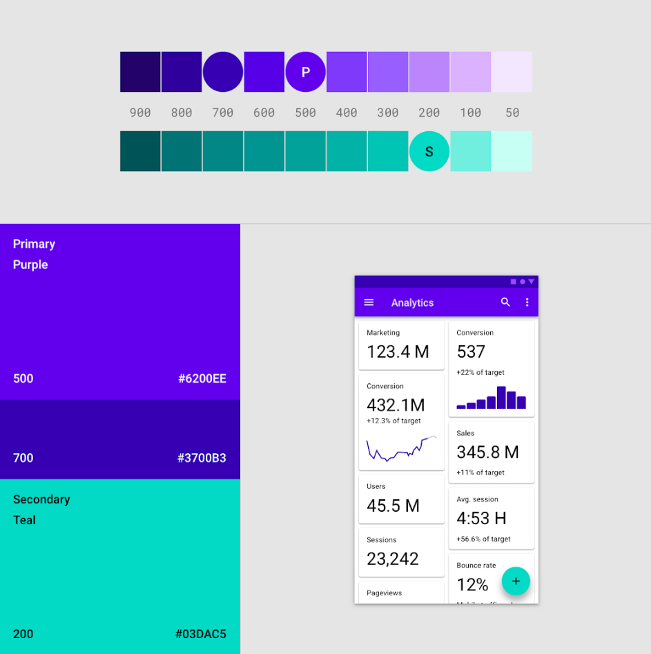
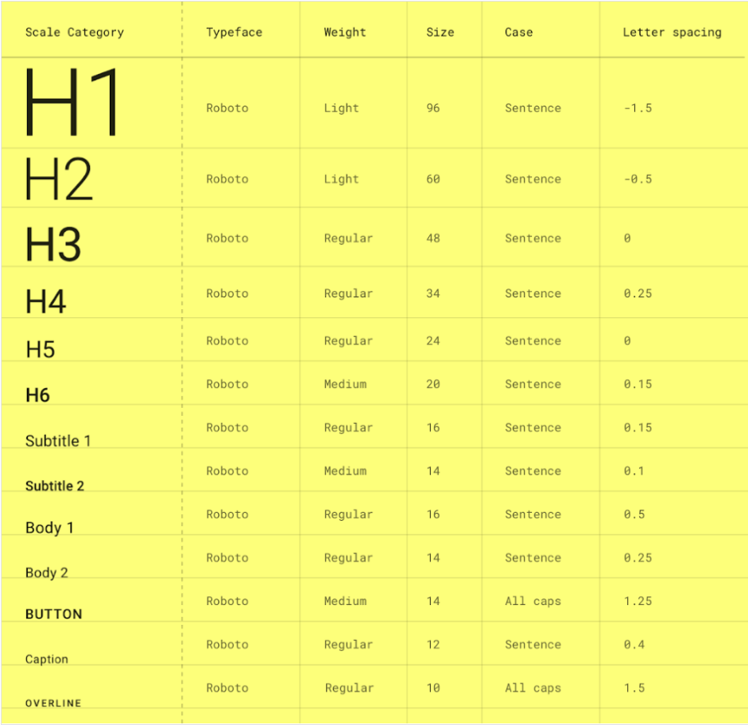

# Name of the project
UI

## Contents

1. [Chapter I](#chapter-i) \
    1.1. [MoodBoard](#moodboard) \
    1.2. [Task 1](#task-1) \
    1.3. [Палитра цветов и стили цвета](#палитра-цветов-и-стили-цвета) \
    1.4. [Task 2](#task-2) \
    1.5. [Типографика, шрифт и стили шрифта](#типографика-шрифт-и-стили-шрифта) \
    1.6. [Task 3](#task-3) 
2. [Chapter II](#chapter-ii) \
    2.1. [Композиция и сетки](#композиция-и-сетки) \
    2.2. [Task 4](#task-4) \
    2.3. [Task 5](#task-5) 
3. [Chapter III](#chapter-iii) \
    3.1. [UI-паттерны и принципы](#ui-паттерны-и-принципы) \
    3.2. [Task 6](#task-6) \
    3.3. [Доступность интерфейса](#доступность-интерфейса)
4. [Chapter IV](#chapter-iv) \
    4.1. [Task 7](#task-7) 

<h2 id="chapter-i">Chapter I</h2> 

В прошлом проекте у тебя получилось составить каркас твоего сервиса, теперь пора добавить серому вайрфрейму красок.

Если ты создаёшь интерфейс уже существующего бренда, то вероятнее всего ты сможешь использовать готовый бренд-бук, ui-кит или дизайн-систему. Если же тебе предстоит разработать интерфейс “с нуля”, то необходимо определиться со стилистикой и дизайн-концепцией интерфейса.

<h3 id="moodboard">MoodBoard</h3>

При подборе цветов для интерфейса, может появиться вопрос: “а с чего вообще начать?”. На помощь приходит мудборд.

Мудборд - это набор-коллаж, который содержит:
* изображения;
* шрифты;
* цветовые гаммы;
* графику;
* узоры;
* сетки;
* скриншоты интерфейсов;
* любые изображения, подходящие по атмосфере и настроению.

Все изображения мудборда должны относиться к проектируемому сервису, благодаря мудборду создаётся “настроение” будущего интерфейса.

В создании мудборда может помочь составление облака ассоциаций. С чем у тебя ассоциируется твой проект? О чём он?
Выписывай первое, что придет на ум, расширяй подобранные понятия и находи в них подсказки для формирования стилистики интерфейса.

<h3 id="task-1">Task 1</h3>

* создай design-файл “ui-project”
* напиши в файле ui-project тему сервиса, для которого проектируется интерфейс
* напиши в файле ui-project минимум 6 ассоциаций с сервисом
* на основе ассоциаций создай мудборд, который будет содержать не менее 12 изображений

<h3 id="палитра-цветов-и-стили-цвета">Палитра цветов и стили цвета</h3>

Создав мудборд, ты получил примерную стилистику будущего интерфейса, теперь надо выделить из мудборда стилистические решения
Начнём с палитры, которая будет использоваться при создании UI.

За счёт цвета создаётся иерархия и акцентные точки, что помогает пользователям лучше ориентироваться в интерфейсе, подчёркивается сфера, для которой используется интерфейс и задаётся настрой сервиса или приложения.

Чаще всего выделяют определённый набор цветов для конкретных элементов интерфейса. Чем больше различных несвязанных цветов будет в интерфейсе, тем тяжелее будет его воспринимать и пользоваться им.

В набор цветов входит основной/акцентный цвет, который будет появляться на кнопках действий и выделять значимые места интерфейса, дополнительный/второстепенный цвет, который дополняет акцентный цвет и который используется для построения блоков интерфейса и для менее главной информации, цвет заднего фона приложения (обычно выбирается белый/чёрный или близкие к ним), цвет фона занимает большую часть интерфейса, поэтому это должен быть очень спокойный и не пёстрый цвет, цвет для текста (как для светлых подложек, так и для тёмных), цвета для success, info, alert и error стейтов, grayscale.

Выбранные цвета являются базовыми для цветовой растяжки, из которой мы получим оттенки. Из полученных путём “растяжки” базовых цветов оттенков будет строиться интерфейс.

Также ознакомься с правилом 60-30-10, которое помогает при использовании палитры для проектирования интерфейса.

Существуют специальные сервисы для генерации палитр и цветовых сочетаний.

<h3 id="task-2">Task 2</h3>

* добавь в файл ui-project палетку (палитру в виде квадратов с цветами) для твоего интерфейса;
* подпиши все цвета в соответствии с их назначением и напиши рядом с каждым его hex-значения;
* сделай цветовые растяжки для цветов;
* добавь все цвета растжек в стили файла в фигме.

<h3 id="типографика-шрифт-и-стили-шрифта">Типографика, шрифт и стили шрифта</h3>

Основное правило типографики — это соблюдать лучшую удобочитаемость, где под удобочитаемостью подразумевается скорость распознавания отдельных знаков и текста.

Если интерфейсный шрифт сложно разобрать и скорость чтения будет падать, то это плохой шрифт. Используйте максимально простые шрифты.

Много простых и удобочитаемых интерфейсных шрифтов уже находятся в фигме, так что можно выбирать из них.

Чтобы интерфейс был консистентым, для разных компонентов необходимо использовать один шрифт или шрифтовую пару, поэтому необходимо создать набор вариаций шрифтов, который будет использоваться в проекте.

<h3 id="task-3">Task 3</h3>

* добавь в файл ui-project шрифтовые пары и сделай “таблицу”, как в примере (вариации шрифтов могут отличаться от того, что в таблице);

* добавь все шрифты в стили шрифтов файла;
* назови все стили шрифтов.

<h2 id="chapter-ii">Chapter II</h2>

<h3 id="композиция-и-сетки">Композиция и сетки</h3>

Композиция — это гармоничное расположение объектов на экране относительно друг друга и окружения.

Композиция помогает направить внимание пользователя в интерфейсе. С помощью композиции можно “привязать” взгляд пользователя к “акцентным” элементам интерфейса.

Хорошей композиции добиваются благодаря направляющим вектора внимания, иерархии объектов, баланса, якорных объектов, ритма, принципа близости.

Существуют статическая (симметричная) и динамическая (ассиметричная) композиции.

<h3 id="task-4">Task 4</h3>

* опиши в файле “ui-project” принципы статической и динамической композиций;
* приведи примеры в виде скриншотов для каждой из композиций.

Вспомогательным инструментом для создания интерфейса выступают сетки. Они помогают грамотно организовывать контент на странице, а также упрощают проработку адаптивности интерфейса (об этом расскажем в дальнейшем проекте).

Существую различные виды сеток:
* колоночная;
* модульная;
* иерархическая;
* блочная.

<h3 id="task-5">Task 5</h3>

* опиши в файле “ui-project” принципы построения колоночных, модульных, иерархических и блочных сеток;
* приведи примеры в виде скриншотов для каждой из сеток.

<h2 id="chapter-iii">Chapter III</h2>

<h3 id="ui-паттерны-и-принципы">UI-паттерны и принципы</h3>

Также как и с UX-паттернами, в UI уже есть набор зарекомендовавших себя решений для различных задач, таких как онбординг, пустые состояния, загрузка, верификация профиля и аккаунта, главная страница, состояние ошибки, поиск/фильтры, приглашение и публикация, оформление заказа, геймификация.

Но эти паттерны не являются просто решениями, которые нужно копипастить в твой проект, они являются визуальными стратегиями для быстрого и эффективного решения базовых проблем UI-дизайна.

UI-принципы — это набор правил, применив которые, можно добиться более удобного для использования и привлекательного интерфейса.

Основными UI-принципами являются:
* консистентность;
* аксессибилити;
* иерархия;
* ясность;
* узнаваемость.

<h3 id="task-6">Task 6</h3>

* опиши в файле “ui-project” суть принципов консистентности, аксессибилити, иерархии, ясности и узнаваемости;

<h3 id="доступность-интерфейса">Доступность интерфейса</h3>

Доступность — это состояние интерфейса (или любого другого объекта), при котором его могут беспрепятственно использовать люди с ограниченными возможности. Дизайн с учётом веб-доступности означает, что нужно учитывать восприятие сайта всеми пользователями, независимо от их визуальных, слуховых, моторных или когнитивных способностей.

Важно осознать, что любой человек сталкивается с ограничениями. Закрывая потребности людей с инвалидностью, вы облегчаете опыт использования сервиса для всех, кто испытывает особенные потребности постоянно, временно или ситуативно. Например: не иметь одной руки — это постоянное состояние, сломать руку и ходить в гипсе — временное, а качать ребенка на руках — ситуативное. Однако в каждом случае человек может действовать только одной рукой.

Для того, чтобы обеспечить доступность интерфейса, необходимо соблюдать основные принципы доступности: 
* Воспринимаемость — люди должны иметь возможность воспринимать контент тем способом, который им удобен;
* Понятность — контент и интерфейс должны быть понятны всем людям, в том числе и с инвалидностью;
* управляемость — люди должны иметь возможность взаимодействовать с интерфейсом и управлять контентом тем способом, который им доступен;
* надежность — интерфейс должен оставаться доступным при изменении версий продукта или операционной системы.

Следуя принципам доступности вы создаете более удобный продукт для всех пользователей. Существует стандарт доступности, разработанный консорциумом World Wide Web Consortium (W3C): https://www.w3.org/Consortium/mission.

Помимо соблюдения стандартов цвета и контрастности важно уделять внимание типографике, чтобы пользователь мог без труда прочесть текст на странице (при этом не забывая о размерах устройства, на котором будет использоваться система); также текст должен быть читабельным – с понятными заголовками, не использовать идиомы или неоднозначные, вводящие в заблуждение, слова и выражения; учитывайте уровень знаний ваших пользователей о предметной области.

Особое внимание необходимо уделить структуре страницы и наименованиям объектов. Это важно для людей с ограничениями по зрению, которые используют скринридеры – специальные программы, озвучивающие контент интерфейса. Необходимо делать дизайн таким, чтобы пользователь мог быстро и легко находить ключевую информацию. Все содержимое и дизайн должны иметь логическую структуру заголовков, которые должны поддерживаться в коде. Также необходимо убедиться, что пользователи могут перемещаться по сайту несколькими способами: оглавление, карта сайта, ссылки между страницами, поиск на сайте и тд. Желательно не использовать модальные окна для ключевого функционала инферфейса, так как скринридеры плохо работают с всплывающими объектами. 

<h2 id="chapter-iv">Chapter IV</h2>

Теперь, когда у тебя есть стили цветов и шрифтов, мудборд и вайрфреймы, необходимо проработать внешний вид всех экранов сервиса.

<h3 id="task-7">Task 7</h3>

* создай в файле “ui-project” страницу ui;
* используй созданные стили цвета и шрифтов, а также мудборд и создай интерфейс экранов сервиса на основе вайрфреймов, созданных в прошлом проекте.

