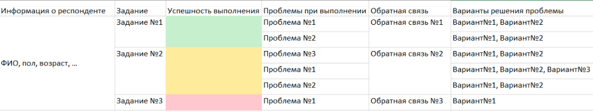

# Прототипирование и тестирование прототипа
Узнаете о прототипировании и проведёте исследование прототипа

## Contents

1. [Chapter I](#chapter-i) \
    1.1. [Прототипирование](#прототипирование) \
    1.2. [Task 1](#task-1) 
2. [Chapter II](#chapter-ii) \
    2.1. [UX-копирайтинг](#ux-копирайтинг)
3. [Chapter III](#chapter-iii) \
    3.1. [UX-исследования прототипа](#ux-исследования-прототипа) \
    3.2. [Task 2](#task-2) \
    3.3. [Task 3](#task-3)

<h2 id="chapter-i">Chapter I</h2> 

<h3 id="прототипирование">Прототипирование</h3>

Прототипирование — это важный этап проектирования продукта. Основная цель прототипа — протестировать идею до начала разработки и улучшить пользовательский опыт.

Раньше, чтобы можно было протестировать взаимодействие с готовым интерфейсом, нужно было задействовать силы фронтенд-разработчиков, которые должны были реализовать его и все его взаимодействия. Сейчас существует множество инструментов, позволяющих создавать интерактивные прототипы без участия разработчиков. Это экономит ресурсы при создании продукта, а также ускоряет процесс доведения продукта до финального вида, поскольку создание прототипа в графических приложениях намного быстрее, чем реализация интерфейса в коде.

Также, создав прототип, можно полностью продемонстрировать необходимое поведение всех элементов разработчикам, что позволяет сократить время на дополнительные уточнения разработчиками задумок дизайнера.

С помощью прототипа можно демонстрировать разработанный интерфейс заказчику, чтобы выяснить, выполнены ли все требования и пожелания.

Прототипировать можно как lo-fi (low fidelity или “низкая точность”), так и hi-fi (high fidelity или “высокая точность”) макеты интерфейса.

<h3 id="task-1">Task 1</h3>

* создай design-файл “prototyping”
* создай страницу “lo-fi”
* перенеси в файл prototyping на страницу “lo-fi” wireflow из проекта 4
* создай интерактивный прототип на основе wireflow
*  назови “сценарий” (flow) прототипа “lo-fi prototype”

<h2 id="chapter-ii">Chapter II</h2>

<h3 id="UX-копирайтинг">UX-копирайтинг</h3>

UX-копирайтинг — это создание интерфейсных текстов для продукта, которые улучшают навигацию и простоту использования интерфейса для пользователей. Под интерфейсными текстами подразумеваются заголовки, надписи на кнопках и в снекбарах, подсказки, тексты тултипов и сообщений об ошибках и т.д.

UX-копирайтинг отличается от маркетингового. UX-копирайтинг направлен на улучшение пользовательского опыта, в то время как маркетинговый копирайтинг направлен на выделение преимуществ продукта и создание его образа, чтобы убедить людей пользоваться приложением или сервисом. В то время, как интерфейсные тексты отражаются на продуктовых метриках.

Интерфейсные тексты помогают пользователю понять:
* что происходит на конкретном экране;
* что произойдёт при нажатии той или иной кнопки;
* почему возникла та или иная ошибка, и как её исправить;
* выполнилась ли операция и т.д.

Для того, чтобы пользователь мог решить задачу как можно быстрее, тексты в интерфейсе должны быть простыми и понятными. В интерфейсных текстах не приветствуются канцеляризмы, сложные термины, официозный тон и тем более жаргон.

Помимо этого текст задает тон и стиль общения общения компании/сервиса с пользователем, а также определенное настроение. При этом важно следить, что комплименты, юмор или эмоциональные фразы уместны и не мешают разглядеть суть.

Интерфейсные тексты нужно писать на ранних этапах процесса, так как проблемы с ними часто указывают на проблемы в дизайне. Важно, чтобы написание текстов для интерфейса происходило при тесном взаимодействии с продуктовой командной. Если в спорных моментах не удается объяснить те или иные решения, то часто улучшать нужно именно дизайн, а не текст.

<h2 id="chapter-iii">Chapter III</h2>

<h3 id="ux-исследования-прототипа">UX-исследования прототипа</h3>

Используя прототип, можно тестировать полученный интерфейс на потенциальных пользователях системы, чтобы пронаблюдать, является ли интерфейс удобным и понятным.

Usability-тестирование - один из методов UX-исследования, который применяется для выявления проблем пользователей при использовании спроектированного интерфейса.

<h3 id="task-2">Task 2</h3>

* создай страницу “hi-fi”
* перенеси в файл prototyping на страницу “hi-fi” макеты экранов из проекта 5
* создай интерактивный прототип сервиса
* назови “сценарий” (flow) прототипа “hi-fi prototype”

<h3 id="task-3">Task 3</h3>

* проведи usability-тестирование с не менее чем 5 людьми
* придумай не менее 3 заданий для выполнения респондентами
* создай таблицу-протокол проведения тестирования (информация о респонденте, описание задания, успешность выполнения задания, проблемы на пути к выполнению задачи, обратная связь респондента, варианты решения проблемы)

Пример таблицы (проблем при выполнении задания может не быть, либо быть больше, чем в примере):

