# Проектирование WEB-интерфейса
Узнаете об особенностях проектирования WEB-интерфейсов и создадите адаптивный интерфейс WEB-приложения

## Contents

1. [Chapter I](#chapter-i) \
    1.1. [Фиксированный дизайн](#фиксированный-дизайн) \
    1.2. [Отзывчивый дизайн](#отзывчивый-дизайн) \
    1.3. [Адаптивный дизайн](#адаптивный-дизайн) \
    1.4. ["Современное" решение](#современное-решение)
2. [Chapter II](#chapter-ii) \
    2.1. [Базовый лейаут и сетки под разные устройства](#базовый-лейаут-и-сетки-под-разные-устройства)
3. [Chapter III](#chapter-iii) \
    3.1. [Адаптация контента](#адаптация-контента) \
    3.2. [Подход "Mobile-first"](#подход-mobile-first) \
    3.3. [Task 1](#task-1) \
    3.4. [Task 2](#task-2) \
    3.5. [Bonus task](#bonus-task)

<h2 id="chapter-i">Chapter I</h2> 

Раньше, основной интернет-трафик шёл через компьютеры. Вход на сайты через браузеры телефонов был мал, поэтому никто не задумывался об удобстве и внешнем виде сайтов на экране мобильных телефонов.

<h3 id="фиксированный-дизайн">Фиксированный дизайн</h3>

Для компьютеров использовался статичный или фиксированный дизайн. Создавался один макет, который никак не изменялся при изменении размера экрана или окна. Появлялись горизонтальный и вертикальный скроллы.

Время шло и мобильный трафик уже перерос трафик с десктопных устройств, поэтому дизайнеры и разработчики стали уделять больше внимания отображению сайтов в браузерах портативных устройств.

<h3 id="отзывчивый-дизайн">Отзывчивый дизайн</h3>

Сначала появился отзывчивый дизайн. Он изменяется в зависимости от “доступного пространства” браузера. Контент двигается динамически, элементы меняют расположение на экране, реагируя на изменение ширины бразуера. Этот дизайн не учитывает тип устройства и по большей части предполагает, что сайт будет использоваться с десктопа.

В отзывчивом дизайне проектируется один вариант макета, который “правильно” отображается на всех размерах экранов за счёт fluid лэйаутов, fluid сеток и CSS media и якорных точек ширины экрана.

Отзывчивый дизайн сделать просто и дёшево, однако мы меньше контролируем то, как будет выглядеть дизайн на разных ширинах экрана. Также, существует много шаблонов отзывчивого интерфейса, используя которые, разработчики смогут быстрее реализовать макеты в коде.

Чаще всего отзывчивый дизайн используется для простых сайтов, где не предполагается заполнение сложных форм и т.д.

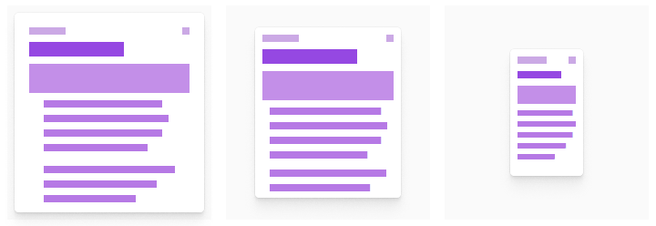

<h3 id="адаптивный-дизайн">Адаптивный дизайн</h3>

После отзывчивого дизайна появился адаптивный дизайн. Адаптивный дизайн предполагает разработку интерфейса для разных типов устройств.

Выделяются диапазоны ширин экрана, соответствующие типу устройства. Далее, для каждого диапазона проектируется индивидуальный интерфейс, который будет корректно отображаться и будет удобен для конкретного типа устройства. Прежде чем выделять диапазоны, важно изучить аудиторию и приоритетные устройства.

Значение ширины между диапазонами называют брейкпойнтом или точкой слома. В этих значениях интерфейс “ломается” и изменяется из того, который был для одного диапазона в другой, который предназначен для следующего. Обычно выделяют четыре-пять брейкпойнтов, чтобы охватить весь спектр устройств и их ориентаций, однако, проанализировав аудиторию, можно сократить количество брейкпойнтов до необходимого

Интерфейсы внутри диапазона статичны, то есть, они не реагируют динамически на изменение ширины экрана. Изменяются только отступы слева и справа от интерфейса.

Благодаря индивидуальному подходу к каждому типу устройств, можно построить наилучший user experience для всех устройств, учесть изменённое управление в мобильных устройствах (тачскрин, вместо указателя мыши).

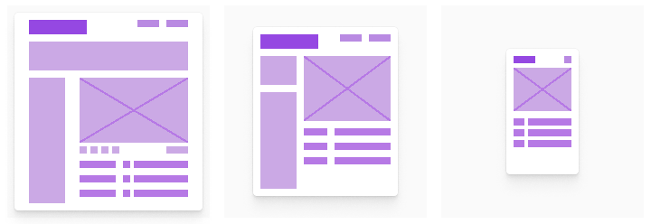

Ниже представлено поведение отзывчивого (сверху) и адаптивного (снизу) дизайна при изменении ширины окна.

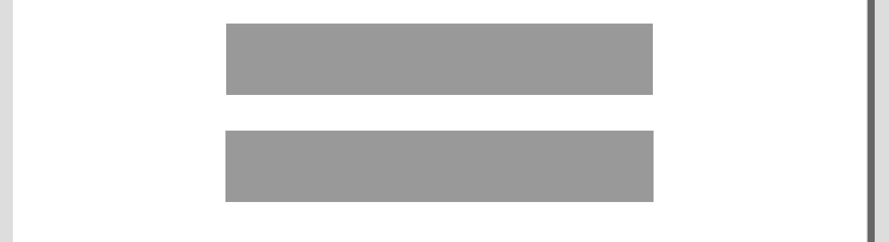

<h3 id="современное-решение">"Современное" решение</h3>

В настоящее время можно встретить комбинацию отзывчивого и адаптивного дизайнов. В диапазонах адаптивного дизайна, используются не статичные макеты, а отзывчивые. Пример такого поведения можно увидеть на платформе школы.

Открой страницу проектов на десктопе и начни уменьшать ширину браузера. Ты увидешь, как сначала уменьшаются поля вокруг контента, потом, при определённой ширине вид контента изменит свой вид, однако, при дальнейшем уменьшении, он будет динамически меняться с шириной браузера. Затем, на следующем брейкпойнте, изменится вид верхней области и т.д.

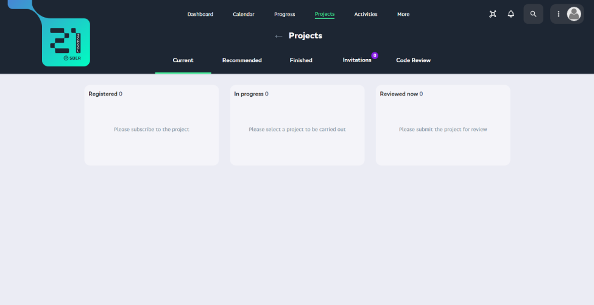

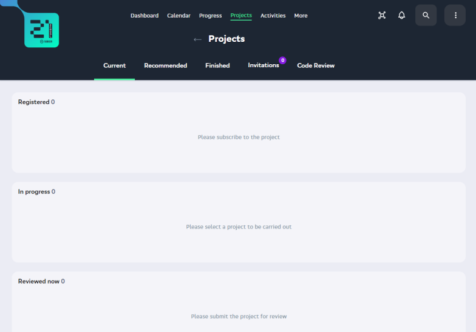

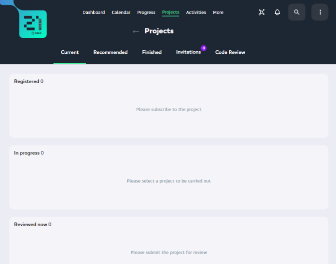

<h2 id="chapter-ii">Chapter II</h2>

<h3 id="базовый-лейаут-и-сетки-под-разные-устройства">Базовый лейаут и сетки под разные устройства</h3>

Базовый лейаут большинства веб-интерфейсов представляет из себя:
1) шапку (хедер);
2) боковую панель;
3) тело страницы (контент);
4) подвал (футер).

Иногда, боковая панель, в которой может находиться навигация, располагается под шапкой.

При учёте отзывчивости и адаптивности, в основном меняют тело страницы, однако, после некоторых брейкпойнотов возникает необходимость изменять шапку или боковую панель.

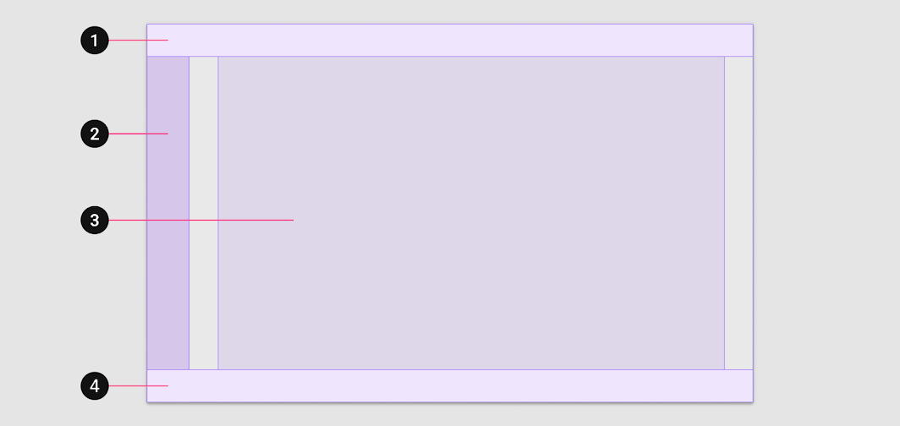

В прошлых проектах мы говорили про различные сетки, по которым строится интерфейс. В этом проекте рассмотрим подробнее колоночную.

Чаще всего для веб-интерфейса используют 12-колоночную сетку, поскольку 12 делится на 2, 3, 4 и 6, что даёт гибкость при размещении контента на сетке.

Сначала строится базовая сетка, которая выглядит, как миллиметровая бумага. Принято использовать значения шага сетки в 8 или 4 пискеля. Затем на базовую сетку “ложится” колоночная сетка.

Колоночная сетка используется при построении адаптивных интерфейсов. У колоночной сетки выделяют размер отступов по бокам, размер колонок и отступов между колонками, а также количество колонок. При уменьшении ширины окна принято уменьшать количество колонок. В таблице ниже приведены значения из дизайн-системы Material Design.

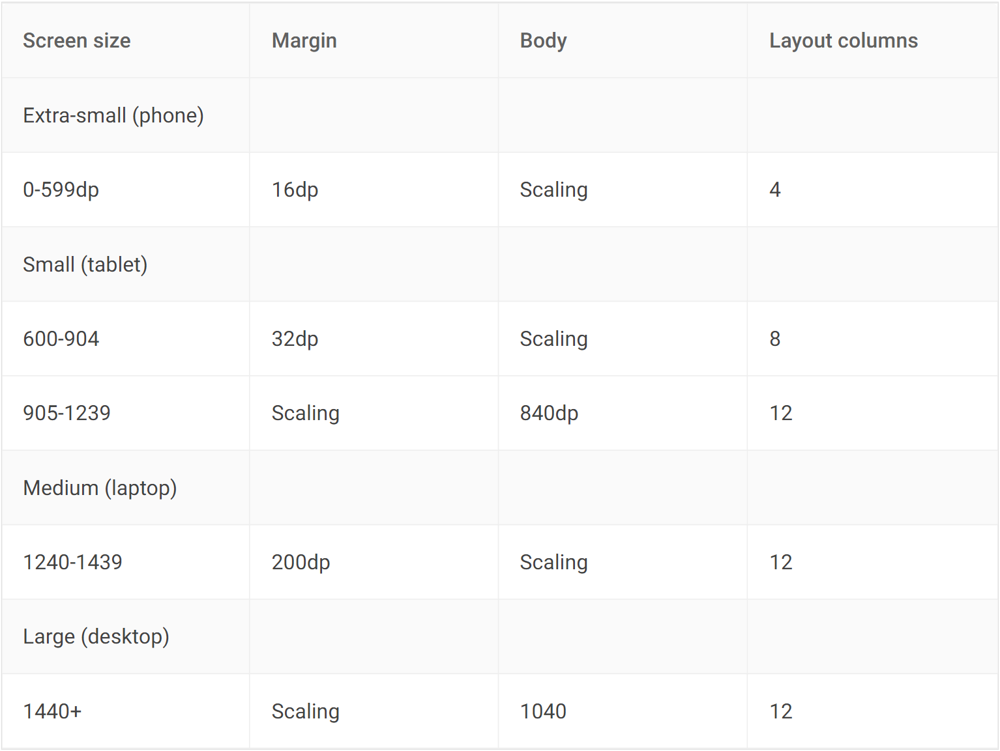

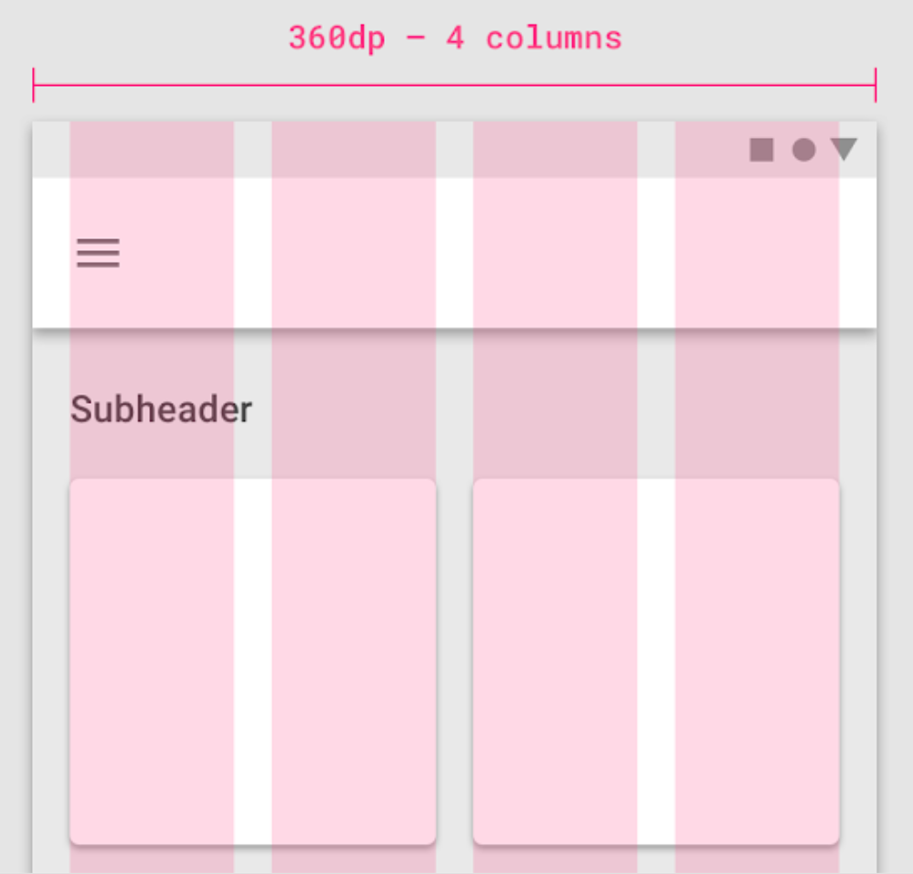

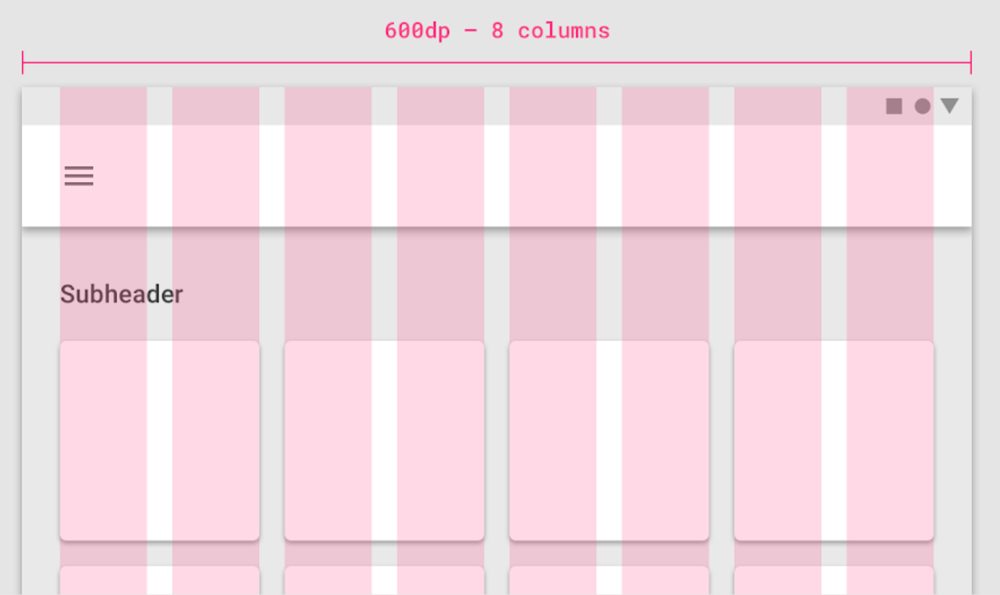

<h2 id="chapter-iii">Chapter III</h2>

<h3 id="адаптация-контента">Адаптация контента</h3>

Маленькие ширины экрана предназначены для устройств с тачскрином, поэтому важно делать все элементы, с которыми пользователь будет взаимодействовать, достаточно большими для нажатия пальцем. Размер касания пальцем принято считать 44-48 пикселей.

При уменьшении экрана уменьшаются и изображения. Реши, будет ли твоё изображение масштабироваться или обрезаться, либо ты будешь подгружать для каждого размера экрана отдельное изображение, которое будет лучше подходить под интерфейс.

Если требуется отображать видео на сайте, то для каждого диапазона ширин нужно определить размер видео-плеера.

Нужно также учесть и изменения размера шрифта. С уменьшением размера экрана должен меняться и шрифт.

При построении интерфейсов для разных устройств важно учитывать, что функционал должен оставаться идентичным. Если на мобильном устройстве нет функционала, который присутствует в десткопной версии, то пользователь, скорее всего, не станет открывать компьютерный вариант. Он уйдёт к конкуренту, который аналогичный функционал у себя в мобильной версии реализовал. Также важно соблюдать консистентность внешнего вида сайта, чтобы пользователь, который посещал сайт на одном типе устройства, зайдя на этот же сайт с другого типа устройства, сразу понял, что это один и тот же сайт.

<h3 id="подход-mobile-first">Подход "Mobile-first"</h3>

Ввиду того, что количество интернет-трафика с мобильных устройств сравнялось и даже начинает превышать количество посещений сайтов с десктопных браузеров, появился подход проектирования интерфейсов mobile-first.

При этом подходе сначала проектируется интерфейс, который будет отображаться на мобильных устройствах, а затем проектируются интерфейсы для более широких экранов на основе спроектированного для мобильных.

<h3 id="task-1">Task 1</h3>

* создайте design-файл “adaptive web”;
* перенесите в файл карточки или элементы интерфейса из проекта 2;
* поменяйтесь карточками или элементами интерфейса внутри команды;
* сделайте карточку или элемент интерфейса отзывчивой по ширине (текст должен переноситься, кнопки расширяться и т.д.). Некоторые элементы будут иметь фиксированный размер, это нормально;

Пример:

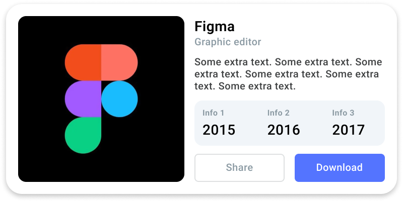

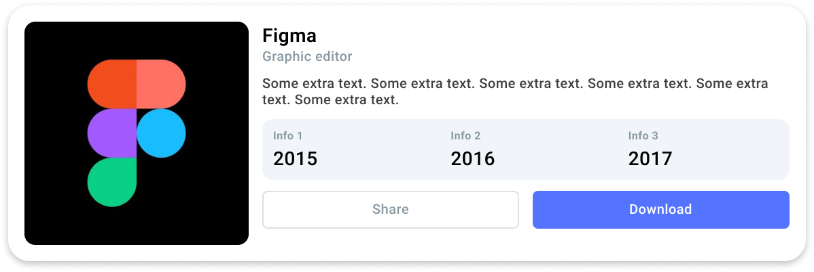

* используйте инструменты фигмы auto layout и constraint для выполнения этого задания.

<h3 id="task-2">Task 2</h3>

* придумайте тему для сайта или веб-приложения, которым можно пользоваться с телефона и десктопа;
* сделайте новую страницу “mobile-first” в файле “adaptive web”;
* напишите тему на новой странице;
* выделите не менее 3 брейкпойнтов;
* укажите значения диапазонов на странице;
* сделайте вайрфреймы экранов сайта для мобильных устройств;
* создайте ui-kit на основе вайрфеймов;
* распределите экраны сайта или веб-приложения между участниками команды;
* сделайте макеты ваших экранов для мобильных устройств;
* макеты должны быть отзывчивыми в пределах диапазона экранов мобильных устройств;
* макеты должны строится с использованием колоночной сетки;
* обменяйтесь распределением экранов и сделайте макеты для оставшихся диапазонов на основе экранов для мобильных устройств;
* макеты для остальных диапазонов также должны быть отзывчивы в рамках диапазона.
