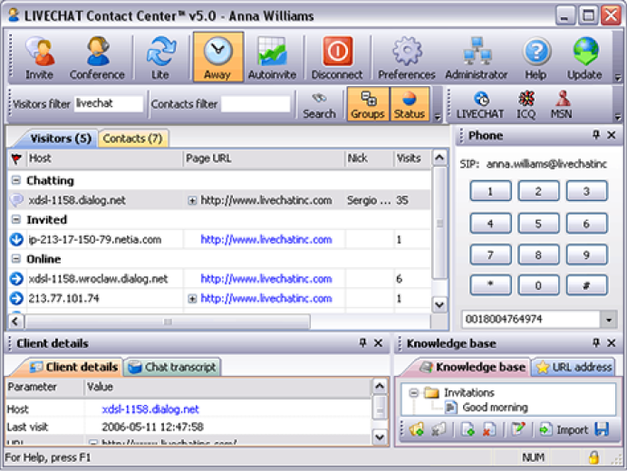
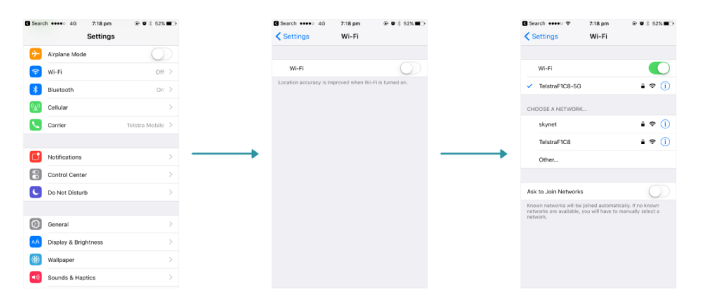
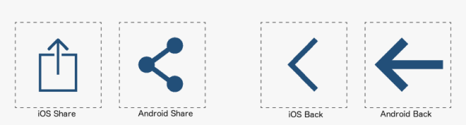
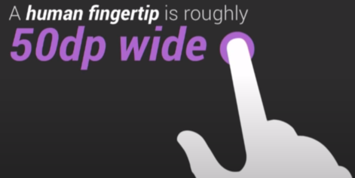
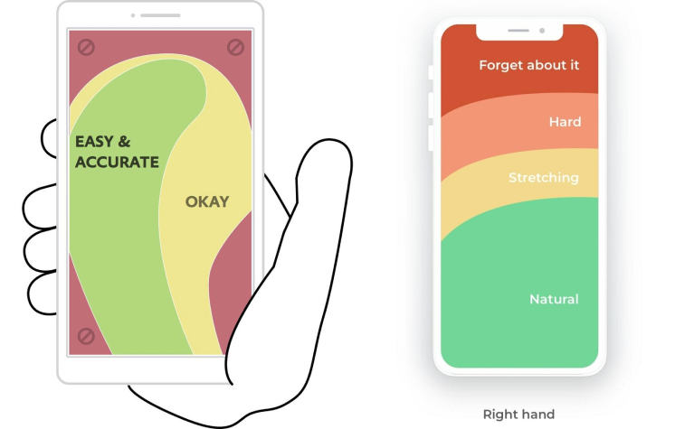
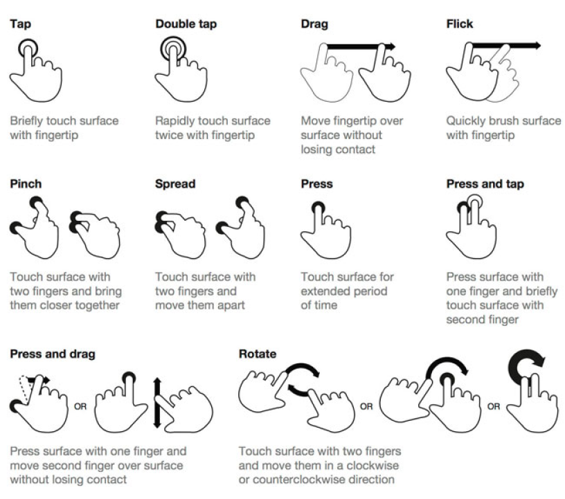

# Проектирование мобильных приложений
Узнаете об особенностях проектирования мобильных приложений для разных устройств

## Contents

1. [Chapter I](#chapter-i) \
    1.1. [Отличия мобильных и десктопных приложений](#отличия-мобильных-и-десктопных-приложений)
2. [Chapter II](#chapter-ii) \
    2.1. [Аудитория](#аудитория) \
    2.2. [Нагрузки при использовании интерфейса](#нагрузки-при-использовании-интерфейса)
3. [Chapter III](#chapter-iii) \
    4.1. [Контекст использования](#контекст-использования)
4. [Chapter IV](#chapter-iv) \
    5.1. [Устройство использования](#устройство-использования)
5. [Chapter V](#chapter-v) \
    5.1. [Способы взаимодействия](#способы-взаимодействия) \
    5.2. [Task 1](#task-1)

<h2 id="chapter-i">Chapter I</h2> 

<h3 id="отличия-мобильных-и-десктопных-приложений">Отличия мобильных и десктопных приложений</h3>

При создании мобильного приложения возникает вопрос: почему бы не оставить адаптивную для мобильных устройств версию сайта и не делать мобильное приложение.

Есть несколько причин, почему приложение удобнее адаптивной версии:
* сайт в браузере “далеко” — чтобы попасть на сайт, нужно открыть браузер, начать вбивать адрес сайта;
* сайт в браузере дольше грузится и может неправильно и неполно отображаться, если запрос прошёл некорректно;
* сайт в браузере не может оперативно уведомлять о новой информации (статус успешности заказа и т.д.).

Если пользователь заходит на мобильную версию сайта чаще, чем раз в неделю-две, то нужно создавать приложение.

Основными различиями между мобильным приложением и десктопной версией являются:
1. аудитория;
2. контекст использования;
3. устройство использования;
4. способ взаимодействия.

<h2 id="chapter-ii">Chapter II</h2>

<h3 id="аудитория">Аудитория</h3>

Аудитория мобильных приложений делится на 2 типа:
* гонщики (охотники);
* первооткрыватели (собиратели).

Гонщики — это пользователи, которым нужно с минимальным количеством усилий, внимания и действий достигнуть свою цель. Например, при вызове такси мы хотим нажать 1 кнопку, чтобы такси уже отправилось нас забирать. В этот момент нас не интересуют баллы, дополнительные предложения и т.д.

Первооткрыватели — это люди, которые готовы изучать приложение. Это могут быть те же “гонщики”, которые вызвали такси, сели в него и уже могут спокойно поисследовать, что находится в приложении.

Эти две роли могут быть в одном человеке. Нужно учитывать, для какого типа пользователей создаётся приложение, и после этого решать, насколько сложно будет устроен интерфейс и какие функции будут выведены на “первый план”.

<h3 id="нагрузки-при-использовании-интерфейса">Нагрузки при использовании интерфейса</h3>

Виды нагрузок на человека при использовании интерфейса:
* когнитивные;
* визуальные;
* моторные;
* внешние.

**Когнитивные нагрузки** - это количество логических связок, необходимых мозгу для осознания и понимания объекта.

Если в твоём интерфейсе будет доступно на одном экране сразу много различного функционала или опций, то пользователям будет тяжело выполнять поставленную для себя задачу. Например, если для покупки товара доступно много вариантов оплаты (несмотря на то, что иметь вариативность кажется хорошей идеей), то мы наоборот усложняем пользователю принятие решения.

**Визуальные нагрузки** - это поиск информации на экране и отделение одной информации от другой.
Если интерфейс мобильного приложения будет перегружен, то пользователю в дороге будет тяжело найти нужный ему функционал и он откажется от использования подобного интерфейса.

Если в десктопном приложении или сайте мы можем разнести большое количество информации по экрану и отделить всё, то на мобильном экране всё более сжато и неразборчиво.

**Моторные нагрузки** - это взаимодействие с интерфейсом, тапы, скроллы, свайпы и т.д.

**Внешние нагрузки** - это всё, что происходит вне приложения: от нового пуш-уведомления до перехода через пешеходный переход. Например, мы взяли себе кофе, вышли на улицу, пошёл дождь - мы взяли зонт и в этот момент нам позвонили, а у нас нет беспроводных наушников, чтобы ответить. В этот момент, внешняя нагрузка очень высокая.

Внешние нагрузки мы не можем предугадать, когда проектируем интерфейс. Они могут возникнуть, а могут и нет. Приложение можно использовать и дома, сидя на уютном диванчике, а может быть и описанная выше ситуация.

Когда все 4 нагрузки “переполнятся”, то пользователь удалит приложение, скажет всем, что оно сложное, и придётся долго восстанавливать репутацию.

Если внешние нагрузки мы не можем предугадать и сбалансировать, значит необходимо снизить нагрузки, которые нам подконтрольны, поэтому знание контекста использования очень важно.

<h2 id="chapter-iii">Chapter III</h2>

<h3 id="контекст-использования">Контекст использования</h3>

Существует 2 вида контекстов:
* контекст среды;
* контекст интерфейса.

**Контекст среды** - это про то, какие есть внешние нагрузки (место использования, условия взаимодействия с устройством и т.д.).

**Контекст интерфейса** относится к визуальным и когнитивным нагрузкам. В интерфейсе может находиться очень много контекста, на котором сложно сконцетрироваться (как в некоторых социальных сетях): 
* слева столбец со списками разделов и других приложений;
* справа находятся разделы с фото и видео, возможными друзьями;
* по центру - несколько строк с разной информацией, а сверху ещё и навбар.

Если на компьютере это смотрится более-менее прилично, то в мобильном приложении подобное не пройдёт.

Для облегчения интерфейса есть метод прогрессивного раскрытия. Он может быть тебе знаком по статьям в журналах и газетах.

Метод прогрессивного раскрытия:
1. заголовок, в котором объясняем, что происходит;
2. подзаголовок, в котором более расширенно рассказывается, что будет дальше;
3. текст, в котором располагается основная информация;
4. дополнительная информация.

Поэтому в случае перегруженного интерфейса, лучше разносить контент в разные разделы.

<h2 id="chapter-iv">Chapter IV</h2>

<h3 id="устройство-использования">Устройство использования</h3>

Операционная система устройства это тоже контекст, как и природа вокруг нас. У каждой операционной системы есть свои паттерны, которые работают как закон природы.

Законы операционных систем работают на наших привычках (мы знаем, что произойдёт, когда мы что-то сделаем). Смахнули уведомление - оно закрылось, потянули вниз - список обновился и т.д. Как и если бы мы подняли какой-то предмет и отпустили его, он бы упал вниз, но если бы этот предмет вдруг взлетел бы вверх, это было бы очень неожиданно.

Поэтому нужно соблюдать консистентность “привычек” и проектировать интерфейс так, чтобы базовые элементы работали так, как от них этого ждут, тогда и разработчикам будет легче реализовывать интерфейс в коде.

Привычки строятся на:
1. триггер (например, пуш-уведомление с сообщением);
2. действие (нажимаем на уведомление);
3. награда (открывается чат и мы видим сообщение);
4. инвестиция (отвечаем на сообщение).

В разных операционных системах используется свой “базовый” лейаут. У Android, например, есть кнопки управления навигацией внизу экрана, чего в iOS нет. Иконки одного и того же действия у Android и IOS также различаются и люди, которые используют конкретную ОС, знают значение иконок без подписей. Эти “привычки” относящиеся к каждой из ОС нужно учитывать при проектировании интерфейсов.

У каждой из ОС есть свои гайдлайны для проектирования приложений:
* Human Interface Guidelines для iOS (https://developer.apple.com/design/human-interface-guidelines/guidelines/overview);
* Material Design для Android (https://m3.material.io/).

<h2 id="chapter-v">Chapter V</h2>

<h3 id="способы-взаимодействия">Способы взаимодействия</h3>

На десктопе у нас есть курсор, который является “продолжением нашей руки”. На мобильных же устройствах мы используем нашу руку непосредственно. Пальцы бывают разных размеров и длин.
Достаточно большой областью нажатия принято считать 44-48 dp (где dp, это [density independent pixel](https://m2.material.io/design/layout/pixel-density.html#pixel-density-on-the-web). В iOS вместо dp используется обозначение pts или points).

Используют телефон также по-разному: кто-то полностью использует только одной рукой, кто-то держит одной рукой, а другой нажимает на экран, а кто-то всегда использует обе руки для взаимодействия с интерфейсом.

Самый “проблематичный” тип использования - использование одной рукой, поскольку пользователь не может использовать всю область экрана, не прибегая к дополнительным перемещениям телефона в руке.

Разные исследования показывают разные области удобства нажатия при разном удержании устройства, но правдой остаётся то, что область вокруг центра экрана является самой точной зоной, в которую можно попасть пальцем.

Большую часть времени пользователи держат устройство вертикально, однако необходимо проработать и внешний вид интерфейса при работе устройства в горизонтальном положении.

Также, при использовании мобильных устройств, у пользователя есть возможность пользоваться жестами. Жесты также являются “привычками” при использовании интерфейса и о них нельзя забывать.

У мобильных устройств есть доступ и к геопозиции, микрофону, камере, сканеру отпечатков пальцев и т.д. При проектировании приложения можно улучшить опыт использования за счёт имплементации данных с этих комплектующих устройства в приложение (голосовой ввод, сканирование QR-кода, определение текущего местоположения на карте вместо мануального ввода текущего адреса, авторизация по сканированию пальца или распознаванию лица и т.д.)

<h3 id="task-1">Task 1</h3>

* придумайте тему для мобильного приложения или возьмите одну из тем из предыдущего командного проекта;
* создайте design-файл “mobile app”;
* переименуйте первую страницу в “wireframes”;
* напишите тему мобильного приложения на странице “wireframes”;
* сделайте вайрфреймы экранов мобильного приложения;
* создайте 2 новые страницы “ios” и “android”;
* создайте ui-kit для ios и android (на соответствующих страницах) на основе вайрфеймов;
* используйте шрифт Roboto для android и шрифт San Francisco для ios;
* распределите экраны приложения между участниками команды (не менее 2 экранов на каждого участника команды для каждой операционной системы);
* сделайте вертикальные и горизонтальные макеты мобильного приложения для ios и android
* экспортируйте файл "mobile app" в формате .fig и загрузите его в папку репозитория.

