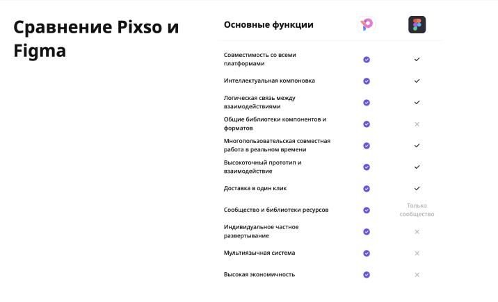

# Плагины и Figma community
В этом проекте вы познакомитесь с дополнительными возможностями Figma.

## Contents

1. [Chapter I](#chapter-i) \
    1.1. [Плагины Figma](#плагины-figma) \
    1.2. [Task 1](#task-1)
    1.3. [Figma community](#figma-community) \
    1.4. [Task 2](#task-2)
2. [Chapter II](#chapter-ii) \
    3.1. [Интерфейсная анимация в Figma](#нтерфейсная-анимация-в-figma) \
    3.2. [Task 3](#task-3)
3. [Chapter III](#chapter-iii) \
    4.1. [Альтернатива Figma](#альтернатива-figma) \
    4.2. [Bonus task](#bonus-task)

<h2 id="chapter-i">Chapter I</h2> 

<h3 id="плагины-figma">Плагины Figma</h3>

Как вы уже поняли, Figma достаточно удобный и простой в освоении инструмент для проектирования дизайна, обладающий широкими возможностями и гибкими настройками элементов интерфейса.

Чтобы расширить базовый фукционал редактора вы можете использовать плагины, сделав работу в Figma еще удобнее и эффективнее. Для этого нужно открыть проект, кликнуть на кнопку Resources в верхней панели, найти необходимый плагин и запустить плагин, нажав на кнопку Run. Если вы пока не знаете, какое дополнение хотите установить, то можете изучить каталог в разделе Community.

Существует огромное количество различных плагинов для Figma. Рассмотрим несколько из них для решения разных задач.

Blobs и Get Waves
Blobs позволяет нам делать простые абстрактные фоны в виде пятен. А Get Waves позволяет генерировать различные волны.

Image Tracer
Плагин, который позволяет быстро перевести растровое изображение в векторное.

Unsplash
Доступ к ресурсам одного из самых популярных бесплатных стоков прямо из интерфейса Figma.

Color Kit
Этот плагин позволяет сгенерировать темные или светлые оттенки нужного цвета с выбором шага. Может пригодиться при создании UI кита для проекта.

Noise & Texture 
Позволяет накладывать на изображения текстуры и паттерны (прямо как в Photoshop).

Illustrations 
Большая бесплатная библиотека иллюстраций в разной стилистике

Charts 
Умеет строить линейные графики, диаграммы рассеяния, диаграммы с областями, барчарты и пайчарты. 

Table Creator 
Плагин для создания таблиц прямо как в Microsoft Word. 

Easometric 
для рисования в изометрии. Изометрия часто используется в инфографике — в такой проекции можно показать максимум визуализаций, и они не будут наслаиваться. Плагин позволяет автоматически поворачивать фигуры, иконки, картинки и надписи под нужными углами. Так, используя обычные пиктограммы и иллюстрации, можно в несколько кликов собрать инфографику в изометрии.

Contrast Checker 
С помощью плагина можно проверить контрастность.

<h3 id="task-1">Task 1</h3>

* создай design-файл в Figma и назови его "ui-bonus";
* создай в файле "ui-bonus" мокап с несколькими экранами мобильного и десктопного приложений из проекта 10;
* размести мокапы на странице презентации, где на фоне будут использованы blob'ы или wave'ы;
* сделай таблицу, исследования конкурентов из проекта 3 с помощью инструментов Figma. 

<h3 id="figma-community">Figma community</h3>

Помнимо плагинов в разделе Figma Community вы можете просматривать и искать тысячи файлов, опубликованных другими пользователями: дизайн-системы, паки иконок, вайрфреймы, иллюстрации и многое другое. 

В Community есть даже официальные аккаунты таких крупных дизайн-компаний как [Microsoft](https://www.figma.com/@microsoft) и [Google](https://www.figma.com/@materialdesign). И, конечно, много полезных файлов от самих [Figma](https://www.figma.com/@figma).

Раздел для вдохновения - Inspiration

Раздел для Figma Jam (командные сессии) - Jam Sessions

Готовые дизайн-системы - Design systems

Готовые наборы дополнений - Visual assets

Дополнительные решения для разработчиков "Development" - Development

Как скачать и использовать файлы

Открыть нужный файл и нажать на кнопку Duplicate в правом верхнем углу

Файл автоматически открывается в новом окне и сохраняется в драфтах аккаунта

<h3 id="task-2">Task 2</h3>

* найди в Figma Community дизайн-системы или ui-kit'ы Vk и mail.ru (есть ui-kit'ы как для web, так и для android и ios. Для задания достаточно одного файла от каждой компании);
* сделай дубликат этих файлов в свой Draft
* добавь два .fig файла с ui-kit'ами в репозиторий.

<h2 id="chapter-ii">Chapter II</h2> 

<h3 id="интерфейсная-анимация-в-figma">Интерфейсная анимация в Figma</h3>

Ранее вы научились создавать кликабельные прототипы в Figma, настраивая переходы от одного фрейма к другому. Помимо обычного переключения между экранами по клику вы можете настроить анимированные взаимодействия с прототипом интерфейса. 

Анимации в интерфейсе выполняют несколько функций: сглаживают переходы между экранами, учат пользоваться функционалом приложения или просто направляют внимание пользователей.

Настройка анимаций происходит все в той же вкладке Prototype справа от рабочей области. Если создать новое взаимодействие с фреймом (через графу Interaction или перетащив стрелку связи от одного объекта к другому), то можно установить настройки взаимодействия.

Тип взаимодействия:
* On click — при клике на объект (если выбран весь фрейм, а не объект, – то при клике на любую область фрейма).
* On drag — при перетаскивании.
* While hovering — при наведении.
* While pressing — при удержании клика.
* Key/gamepad — при нажатии на горячую клавишу.
* Mouse enter — при появлении курсора в области объекта.
* Mouse leave — при покидании объекта курсором.
* Mouse down — в начале клика.
* Mouse up — в конце клика.

Действие:
* None — ничего не происходит.
* Navigate to — перейти к (другому объекту/фрейму).
* Open overlay — наложить поверх текущего фрейма.
* Scroll to — пролистать до другого объекта в рамках одного фрейма.
* Swap overlay — заменить один фрейм другим.
* Back — перейти назад.
* Close overlay — закрыть объект, наложенный поверх фрейма с помощью Open Overlay.
* Open link — перейти по ссылке.

Анимация:
* Instant — мгновенно.
* Dissolve — растворение.
* Smart animate — умная анимация (о ней поговорим ниже).
* Move in — перемещение внутрь.
* Move out — перемещение наружу.
* Push — смахивание.
* Slide in / Slide out — перемещение с растворением.

У всех переходов, кроме Instant, можно выбрать степень плавности, с которой он будет происходить, а также продолжительность. Эти настройки находятся ниже выбора типа самого перехода.
* Linear — линейно (плавно).
* Ease in — анимация начнется медленно и будет ускоряться к концу.
* Ease out — анимация начнется быстро и будет замедляться к концу.
* Ease in and out — анимация начнется медленно, ускорится и затем снова замедлится.
* Ease in back — анимация отскакивает назад от исходной точки, а затем ускоряется.
* Ease out back — анимация начинается быстро, затем замедляется и проскакивает вперед от конечной заданной точки.
* Ease in and out back — анимация медленно отскакивает назад от исходной точки, ускоряется и снова замедляется, проскакивая вперед от конечной точки.
* Custom — пользовательский вариант, позволяет вручную установить и настроить плавность.

Тайминг

Взаимодействие анимации в Figma измеряется в миллисекундах и чаще всего подбирается из диапазона от 100ms (0.1s) до 1000ms (1s). Анимацию короче 100 миллисекунд делать не стоит, т.к. она почти неуловима для глаза. А взаимодействие больше одной секунды может вызывать неприятное ощущение задержки или бага. Важно понимать, что появление объектов происходит медленнее, чем исчезновение. А чем меньше объект, тем быстрее он появится.

Smart-анимация

Данный вид анимации самостоятельно анимирует схожие объекты. При этом важно, чтобы объекты имели схожие имена и место в иерархии. Иначе не сработает.

После всех настроек можно посмотреть получившуюся анимацию с помощью кнопки Present в верхнем меню справа или нажав на синюю стрелочку рядом со стартовым фреймом.

<h3 id="task-3">Task 3</h3>

* сделай анимацию в мобильном приложении из проекта 10. При нажатии на какую-либо кнопку, добавь snackbar, который появляется снизу экрана и "уезжает" после 3 секунд;
* повтори анимацию из примера ниже используя smart animate. Загрузи гифку в репозиторий, чтобы проверяющий мог сравнить получившийся у тебя результат с примером. 

<h2 id="chapter-iii">Chapter III</h2> 
<h3 id="альтернатива-figma">Альтернатива Figma</h3>

На данный момент Figma является наиболее популярным инструментом для работы над дизайном интерфейсом по всему миру, в том числе и в России. Весь базовый функционал Figma бесплатный, однако есть некоторые ограничения для командной работы:
* Ваши личные файлы можете редактировать только вы. При этом личных файлов может быть сколько угодно.
* Для командной работы доступны только три файла и один проект.
* История версий хранится 30 дней

Поэтому для больших команд/проектов используются платные тарифы.

Однако, с марта 2022 года Figma заморозила аккаунты Российских компаний, и остановила продажу услуг в России. И многие компании решили перейти на альтернативный инструмент Pixso. 

Как утверждают разработчики Pixso, это лучшая Альтернатива на рынке дизайн-инструментов. Удобный, высоко совместимый и безопасный инструмент.

Pixso во многом похож на Figma, а также поддерживает импорт файлов Figma, Sketch, Adobe XD, Axure, так что пользователь может легко переключится из других инструментов на Pixso. 

На сайте инструмента приводится сравнительная таблица функций Pixso и Figma

<h3 id="bonus-task">Bonus task</h3>

* перенеси в Pixso 5 экранов мобильных или десктопных интерфейсов используя импорт макетов из Figma;
* повтори эти макеты используя инструменты Pixso;
* помести скриншоты импортированных из Figma в Pixso макетов и макетов, сделанных с помощью инструмента Pixso в Figma.

